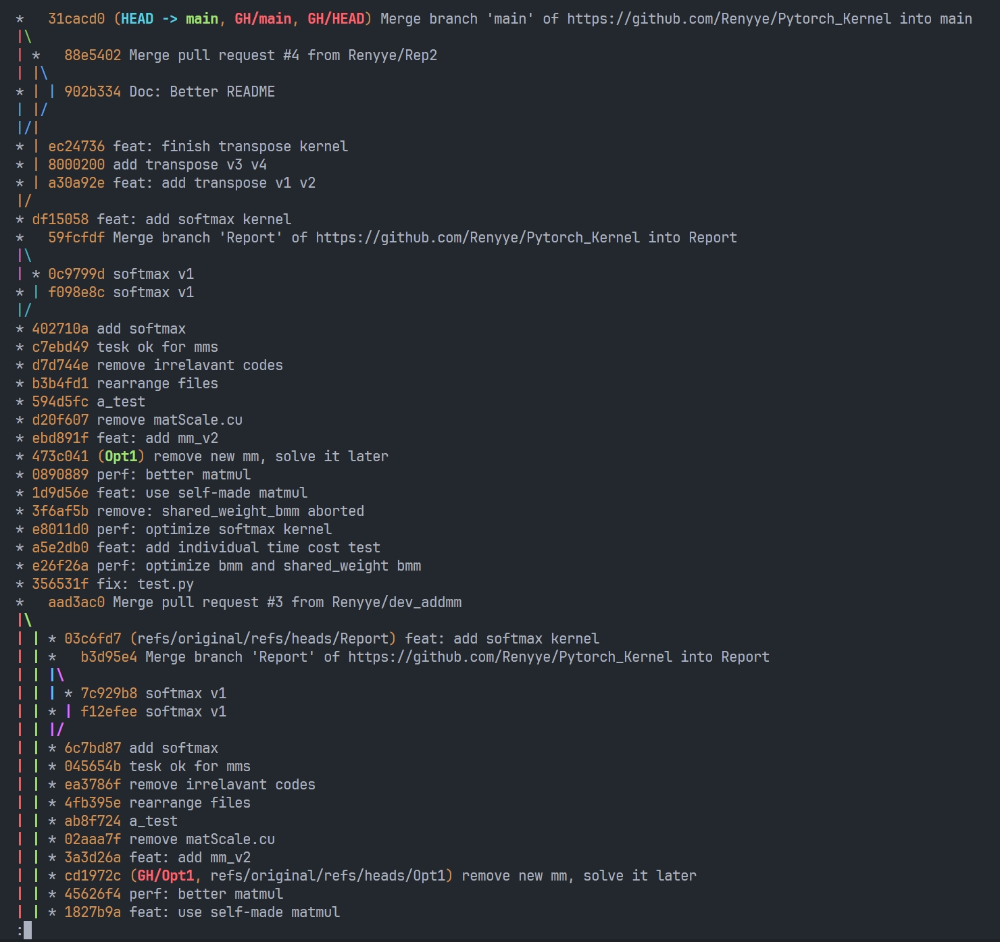

# CS4302 Report

## Part 1 算子调研

在这一部分中，我们探究了 PyTorch 中三个原版算子的实现方法，GPU并行优化等，并构思了自己实现与优化的方式。

### 1) `addmm_cuda` 算子

对于 `addmm_cuda` 算子，其调用了 ` at::cuda::blas::gemm` （位于 `Blas.cpp:297`）：

```cpp
at::cuda::blas::gemm<scalar_t>(
              transpose_mat1 ? mat1_->is_conj() ? 'c' : 't' : 'n',
              transpose_mat2 ? mat2_->is_conj() ? 'c' : 't' : 'n',
              m,
              n,
              k,
              alpha_val,
              mat1_ptr,
              mat1_ld,
              mat2_ptr,
              mat2_ld,
              beta_val,
              result_ptr,
              result_ld);
        });
```

先获取输入矩阵 `mat1`、`mat2` 及结果矩阵 `result` 的数据指针，然后使用 `cuBlas` 中的相应矩阵乘法算子。

#### 并行可行性

矩阵乘法中，每个输出元素 $C_{ij}$ 的计算都只是依赖 $\mathbf{A}$ 的第 $i$ 行和 $\mathbf{B}$ 的第 $j$ 列，每个位置上的元素可以独立计算，不依赖于其他元素的结果，无数据依赖，因此可被并行分配到不同的线程上。矩阵的规模越大，可用并行度也就越高。

#### 并行优化空间

##### 1. Tiling

首先是利用 Shared Memory，加快内存读写。其中要用到分块（tiling），将输入矩阵 $\mathbf{A}, \mathbf{B}$ 按照一定的 tile/block 大小分块加载到共享内存中。通过减少全局内存访问、增大数据复用来提升性能。除了可以使用 shared memory 减少内存读写，还可以利用 register，即通过分配每个线程计算多个元素（有些类似 loop unrolling），从而加强了数据局部性，利用更多寄存器内存来获得更短的计算时间。

##### 2. Bank Conflict

其次可以解决 Bank Conflict 的问题。我们每次需要从矩阵 $\mathbf{A}$ 取一个列向量，而矩阵 $\mathbf{A}$ 在Shared Memory中是按行存储的；在使用 Tiling 后，每次从 Shared Memory 中取数时需要取连续的 $8$ 个数（取决于 tiling_size，假设为 $8$ ），所以一个线程的 load 指令的地址是连续的，那么同一个 Warp 不同线程的同一条 load 指令的访存地址就是相同 Bank 的不同地址，便存在着 Bank Conflict。

后续优化可以考虑将 $\mathbf{A}$ 储存为列优先。

##### 3. Data Prefetching

使用流水并行化 Double Buffering 的方法，使得 **访存-计算** 的串行模式流水线化，以减少等待时间。


### 2) `sum_cuda` 算子

对于 `sum_cuda` 算子，其最终调用了 `input_vectorized_thread_reduce_impl` （位于 `reduce.cuh:500`）。

其流程是：

1. 对齐处理部分：确保数据指针在向量化加载时满足对齐要求
2. 向量化类型定义与索引初始化：利用aligned_vector进行向量化加载
3. 核心向量化归约循环：这是 reduce 操作的核心逻辑，其代码如下：

   ```cpp
       // 3. 核心向量化归约循环
       // 当能完整加载一个向量的元素时持续迭代
       while (idx * input_vec_size + input_vec_size - 1 < end) {
         *values_vector = reinterpret_cast<const load_t*>(data)[idx]; // 向量化加载
   
         // 将已加载的数据逐元素reduce到累积器中
         #pragma unroll
         for (index_t i = 0; i < input_vec_size; i++) {
           value_list[i] = ops.reduce(value_list[i], values[i], shift + idx * input_vec_size + i);
         }
         idx += stride; // 跳到下一个向量块
       }
   ```

4. 尾部处理。因为数据长度可能不是 `input_vec_size` 的整倍数，所以额外处理剩余的几个元素。

5. 最终将多个累积器合并到一个值中，并返回。

这段代码利用 `ops.reduce`（对于 `sum_cuda` 来说，即加法）对数据分块进行部分归约，最终将多个累积器组合（`ops.combine`）为一个结果值并返回。

#### 并行可行性

每个元素的加法操作与其他元素的加法操作是独立的，不存在数据依赖。可以分配到 GPU 上的多个线程独立处理一部分数据，然后再通过结合操作（combine）将结果汇总。

#### 并行维度

加法规约操作可以视作沿一维进行，这里的线程与数据索引可以一一对应。为了提高数据吞吐，通过让多个线程并行地从全局内存读取各自负责的元素块，并进行向量化加载和归约。

因为 GPU 更适合对于 coalesced（合并访问）的内存访问，所以使用 `aligned_vector` 向量化加载和归约可以帮助保证访问的数据是对齐的并且是连续块，这能显著提高内存带宽利用率，从而减小内存访问成为瓶颈的可能性。

并且应用了 ` #pragma unroll` 指令，通过循环展开，进一步减少分支开销，提高了并行性，使得寄存器的分配更高效。

#### 并行优化空间

通过 `partialSum[t] += partialSum[t + stride];`，间隔加法的方法可以消除 Warp divergent。

此外还存在 Bank Conflict[^1]，可以通过以下方式，每次把数据的后半部分加到前半部分上，每次读写都没有bank conflict：

```c++
for (unsigned int stride = blockDim.x / 2; stride > 0; stride >>= 1) {
    if (t < stride) {
        partialSum[t] += partialSum[t + stride];
    }
    __syncthreads();
}
```

最后可以考虑在循环体中使用prefetch，例如使用 `float4` 类型可以在一次内存访问中处理四个浮点数，减少访问延迟。[^1]


### 3) `softmax` 算子

对于 `softmax` 算子，其最终调用了 ` __global__ void cuda_sparse_coo_softmax_kernel` （位于 `SoftMax.cu:84`），核心逻辑如下：

```c++
    for (int64_t j = 0; j < nvalues; j++) {
      scalar_t exp_sums = 0;
      for (int64_t p = 0; p < pool_indices_size; p++) {
        auto i = pool_indices[p];
        auto values_row = input_values_acc[i];
        auto out_values_row = output_values_acc[i];

        auto v = c10::cuda::compat::exp(values_row[j] - mx_row[j]);
        if (!LogSoftMax) {
          out_values_row[j] = v;
        }
        exp_sums += v;
      }
      for (int64_t p = 0; p < pool_indices_size; p++) {
        auto i = pool_indices[p];
        auto values_row = input_values_acc[i];
        auto out_values_row = output_values_acc[i];

        if (LogSoftMax) {
          out_values_row[j] = values_row[j] - mx_row[j] - c10::cuda::compat::log(exp_sums);
        } else {
          out_values_row[j] *= 1.0 / exp_sums;
        }
      }
    }
```

#### 并行可行性

Pytorch 实现中，核心逻辑是对一批行执行 softmax 运算。不同 pool 之间相互独立，且同一个 pool 在处理各个列元素时，每个列元素的处理也是独立的。因此可以把 pool 级别的循环交给线程网格 (grid) 进行并行处理。

#### 并行优化空间

##### 1. Wrap 级编程

调用内置的 `__reduce_add_sync` 和 `__reduce_max_sync`，无需通过共享内存进行 warp 内线程间的通信。

##### 2. Shared Memory + 并行归约

每个线程可以对自己负责的所有元素得到局部最大值，然后通过在 shared memory 中以 `stride /= 2` 的方式迭代，逐步将多个线程的最大值归约到 `shared[0]`。（类似上文的 Vector Reduction，同时也避免了 Bank Conflict）


## Part 2 CUDA Runtime 调研

PyTorch通过CUDA Runtime API 调用，以实现GPU内存管理、数据传输和并行计算调度等基础功能。

> 参考资料 https://www.nvidia.cn/docs/IO/51635/NVIDIA_CUDA_Programming_Guide_1.1_chs.pdf

### 1. `cudaMalloc` 和 `cudaFree`

实现内存分配与释放。`cudaMalloc`用于在GPU设备上分配指定大小的内存。`cudaFree`则负责释放这些内存，管理和避免内存泄漏。例如，当用户创建一个新的CUDA张量时，PyTorch会调用`cudaMalloc`为其分配内存；当张量被销毁或超出其生命周期时，`cudaFree`会被调用来释放内存资源。

### 2. `cudaMemcpy`

在主机（CPU）和设备（GPU）之间进行数据传输时，PyTorch会调用`cudaMemcpy`。

例如将一个张量从CPU移动到GPU进行计算时，PyTorch会调用`cudaMemcpy`将数据从主机内存复制到设备内存。同样，在需要将结果从GPU传回CPU时，也会使用`cudaMemcpy`完成数据传输。

### 3. `cudaStreamCreate` 和 `cudaStreamSynchronize`

当PyTorch初始化CUDA流以支持并行计算时，会调用`cudaStreamCreate`，允许多个操作在GPU上并行执行，从而提高计算效率。

而在需要等待某些异步操作完成时，PyTorch会调用`cudaStreamSynchronize`，保证数据的一致性和计算的正确性。


## Part 3 PyTorch 算子改写

> 想要运行以下代码的测试，请在根目录下运行 `make benchmark_all`。对于各个算子的分别测试，参见 Makefile。

这一部分中我们选择了三个算子进行改写：矩阵乘法、矩阵转置和 SoftMax。

### 1） `custom_matMul_kernel` 矩阵乘法

> 相应源代码参见 ./src/custom_ops/csrc/mm_kernel.cu (v1-v5)

#### a) 未使用 shared memory (mm_kernelv1.cu)

未使用 shared memory 的原始逻辑代码如下

```
__global__ void matMul_naive(const float* A, const float* B, float* C,
                             int M, int N, int K) {
    int row = blockIdx.y * blockDim.y + threadIdx.y;
    int col = blockIdx.x * blockDim.x + threadIdx.x;
    if (row < M && col < N) {
        float sum = 0.0f;
        for (int k = 0; k < K; ++k) {
            sum += A[row * K + k] * B[k * N + col];
        }
        C[row * N + col] = sum;
    }
}

```

对其进行性能测试，1000次 2048*1024 矩阵乘法的所花时间如下：

```
Native matmul Time: 2.1453 seconds
Custom matmul Time: 20.8432 seconds
```

性能是 Pytorch 原版 `torch.matmul` 的 10.66% 。


#### b) 使用 Shared Memory + Tiling (mm_kernelv2.cu)

使用 Shared Memory 前，查看 GPU 的各项参数，如下：

```
Tesla T4
设备全局内存总量：15109MB
SM的数量：40
每个线程块的共享内存大小：48 KB
每个线程块的最大线程数：1024
设备上一个线程块（Block）中可用的32位寄存器数量： 65536
每个EM的最大线程数：1024
每个EM的最大线程束数：32
设备上多处理器的数量：40
```

我们最多可以设置 Block Size 为 $32*32=1024$ 个线程，如果每个线程只处理一个结果，那么 Shared Memory 声明为：

```c
    __shared__ float tile_A[32][32];
    __shared__ float tile_B[32][32];
```

每个 `float` 占用4字节，使用了 $32*32*2*4=8KB$ 的共享内存，利用率为 16.7%。 1000 次 2048*1024 矩阵乘法的性能结果如下：

```
Native matmul Time: 2.1453 seconds
Custom matmul Time: 10.2693 seconds
```

大约可以达到Pytorch 原版 `torch.matmul` 的 21.63% 。

以上提到 Share Memory 利用率低的问题，因为此时每个线程仅计算 一个输出元素。我们还可以让一个线程同时计算矩阵 C 中更大的 tile，例如 2\*2 或 4\*4 等，从而进一步提高计算密度和寄存器利用率。


#### c) 每个线程负责多个元素 (mm_kernelv3.cu)

当我们增大单个线程的计算量时，可以有效地均摊访存开销，同时提升寄存器对数据的复用率。

具体做法是：让每个线程一次性计算输出矩阵 C 中的一个 8×8 子块（即 `TM = TN = 8`），而每个线程块 (Block) 则处理一个 128×128 的输出子矩阵。为了在计算过程中减少访存开销，我们额外在每个线程内部定义了一个寄存器块 `r_c` 用于存储当前线程所负责的部分乘加累加结果，相较于不断访问共享内存，寄存器访问延迟更低、吞吐量更高。

部分相关代码示例如下（示意简化版）：

```c
__global__ void matMul_tiled(const float* d_A, const float* d_B, float* d_C,
                             int M, int N, int K) 
{
    int bx = blockIdx.x;
    int by = blockIdx.y;
    int tx = threadIdx.x;
    int ty = threadIdx.y;

    // 确定该线程在输出矩阵中的起始位置
    int rowStart = (by * blockDim.y + ty) * TM;
    int colStart = (bx * blockDim.x + tx) * TN;

    // 寄存器块，用于保存 TM*TN 大小的累加结果
    float r_c[TM][TN] = {0.0f};

    // 主循环：分块加载 & 乘加 (伪代码)
    for (int kBlock = 0; kBlock < K; kBlock += BK) {
        // 1) 把 A 的分块加载到共享内存 / 寄存器 (省略示例)
        // 2) 把 B 的分块加载到共享内存 / 寄存器 (省略示例)

        // 3) 进行分块乘加运算
        // r_c[i][j] += A_sub(...) * B_sub(...);
    }

    // 将寄存器中的结果写回全局内存
    for (int i = 0; i < TM; i++) {
        for (int j = 0; j < TN; j++) {
            int row = rowStart + i;
            int col = colStart + j;
            if (row < M && col < N) {
                d_C[row * N + col] = r_c[i][j];
            }
        }
    }
}

```

此时每个线程不仅仅负责单个结果元素，而是负责 8*8 的输出块。相关代码可见 mm1.cu，性能测试结果如下：

```
Native matmul Time: 2.1453 seconds
Custom matmul Time: 4.5771 seconds
```

达到了达到 PyTorch 原版算子的 48.54% 。相较于之前单线程只计算 1 个输出元素的基准实现，整体性能提升明显。

同时要注意，在本实现中，每个线程块内的线程数量由
$$
\frac{BM}{TM} \times \frac{BN}{TN}
$$
确定（如 `BM = BN = 128`, `TM = TN = 8` 时，该值即为 16×16=256），需要确保在 GPU 的硬件限制（如最大线程数 1024、寄存器数等）之内。此外，在 K 方向（即中间维度）上也进行分块 (Tiling)，设置 `BK = 8`，每计算完一个宽度为 8 的切片后通过循环继续处理下一个切片，直至完成所有乘加操作。


#### d) 向量化加载与存储 (mm_kernelv4.cu)

对于 **c)** 中程序做进一步分析：对于矩阵分块 A[BM,BK] ，每个Thread需要搬运 BK∗TM∗TN/BN 个浮点数，在该例中该值为 4，使用 `FLOAT4` 函数来操作能让我们一次读取或写回 4 个 `float`，在硬件对齐（16 字节对齐）良好的情况下，可减小指令与地址计算开销，并提高内存带宽利用率[^2]。

所以此时我们需要对齐到 16 字节边界，同时需要防止越界读写。我们在加载到边缘区时做了越界检查，超出的部分填 0；写回时也做了同样的检查。

```c
    // 加载 A 的一个 float4 到 s_a
    if ( (load_a_gmem_m < M) && (load_a_gmem_k + 3 < K) ) {
        int load_a_gmem_addr = OFFSET(load_a_gmem_m, load_a_gmem_k, K);
        FLOAT4(s_a[load_a_smem_m][load_a_smem_k]) = 
             FLOAT4(a[load_a_gmem_addr]);
    }
    else {
        // 越界时，填充 0
        FLOAT4(s_a[load_a_smem_m][load_a_smem_k]) = make_float4(0.f,0.f,0.f,0.f);
    }
```

最后使用 `#pragma unroll` 指令提示编译器对循环进行展开，减少循环控制开销，提升指令级并行度。

在结合了 向量化加载 (float4)、分块 (tiling)、寄存器块 (register tiling) 等多重优化手段后，新算子性能测试如下：

```
Native matmul Time: 2.1453 seconds
Custom matmul Time: 2.6910 seconds
```

在1000 次 2048*1024 矩阵乘法中，可以达到原版算子的 82.55%。


#### e) 解决Bank Conflict + 双缓冲 (mm_kernelv5.cu)

> 代码参考 [[CUDA 学习笔记\] GEMM 优化: 双缓冲 (Prefetch) 和 Bank Conflict 解决_寄存器的bank conflict-CSDN博客](https://blog.csdn.net/LostUnravel/article/details/138324342)

以上代码实现中，不同线程在取数时需要从 Shared Memory 中取连续的 8 个数（TM = TN = 8）；那么同一个 Wrap 内不同线程就会发生 Bank Conflict。解决方法如下：

1. 让矩阵 A 在 Shared Memory 中按列存储。
2. TM 方向上的 Tiling 分为两块 TM/2 * TN。

```c
	__shared__ float s_a[BK][BM];
	
    for (int tk = 0; tk < BK; tk++) {
        FLOAT4(r_comp_a[0]) = FLOAT4(s_a[tk][ty * TM / 2         ]);
        FLOAT4(r_comp_a[4]) = FLOAT4(s_a[tk][ty * TM / 2 + BM / 2]);
        FLOAT4(r_comp_b[0]) = FLOAT4(s_b[tk][tx * TN / 2         ]);
        FLOAT4(r_comp_b[4]) = FLOAT4(s_b[tk][tx * TN / 2 + BN / 2]);
```

其次是双缓冲共享内存（Double Buffering Shared Memory），通过使用两个缓冲区交替加载和计算，隐藏内存加载的延迟，实现计算与数据加载的并行。

```
    __shared__ float As[2][BLOCK_SIZE_K][BLOCK_SIZE_M];
    __shared__ float Bs[2][BLOCK_SIZE_K][BLOCK_SIZE_N];
    float frag_a[2][THREAD_SIZE_Y];
    float frag_b[2][THREAD_SIZE_X];
    // 切换缓冲区索引
    int smem_sel = (bk - 1) & 1;
    int smem_sel_next = bk & 1;
```

性能测试结果如下：

```
Native matmul Time: 2.1453 seconds
Custom matmul Time: 2.2335 seconds
```

可以达到原版算子的 99.46% 。


完整的 v1-v5 测试可以运行 `make benchmark_mm`


### 2) `custom_softmax_kernel` SoftMax 算子

> 相应源代码参见 ./src/custom_ops/csrc/softmax_kernel.cu (v1-v3)

#### a) 基础逻辑

实际中为了避免溢出，在指数上减去最大值后再进行 SoftMax，不影响结果值
$$
m = max(x) \\ \text{Softmax}(x_{i}) = \frac{e^{x_i - m}}{\sum_j e^{x_j -m}}
$$
由此可见，SoftMax 的关键步骤是两个 reduce 操作， max 和 sum。所以最简单的思路是使用三个 for 循环，分别找到最大值、计算 sum 以及最后计算 SoftMax。以下使用 Global Memory 在 N 的维度上并行计算：

```c
    for (int j = 0; j < C; j++) {
        if (inp_row[j] > maxval) {
            maxval = inp_row[j];
        }
    }

    for (int j = 0; j < C; j++) {
        out_row[j] = expf(inp_row[j] - maxval);
        sum += out_row[j];
    }
    
    for (int j = 0; j < C; j++) {
        out_row[j] /= (float)sum;
    }
```

每一个 batch 需要 3 次循环，访存次数非常多，性能只有 Pytorch 原版的 1.68%：

```
Native softmax Time: 0.0862 seconds
Custom softmax_cuda_v1 Time: 5.1425 seconds
Performance ratio: 1.68%
```

#### b) Reduction 优化

同时在最大值计算和求和计算中使用算子调研部分提到的 Reduce 优化方法，使用 `stride/=2` 的方式间隔取数，每次把数据的后半部分加到前半部分上，每次读写都没有bank conflict；最终在 `shared[0]` 位置得到整行的最大值 `offset` 和整行的和 `sum`：

```c
    // reductions
    for (int stride = block_size / 2; stride >= 1; stride /= 2) {
        __syncthreads();
        if (tid < stride) {
            shared[tid] = fmaxf(shared[tid], shared[tid + stride]);
        }
    }
    // reductions
    for (int stride = block_size / 2; stride >= 1; stride /= 2) {
        __syncthreads();
        if (tid < stride) {
            shared[tid] += shared[tid + stride];
        }
    }
```

通过这种方法可以消除 Wrap Divergence 和 Bank Conflict。

在进一步优化中，可以采用动态共享内存。

```c
 extern __shared__ float shared[];
```

我们设置总线程数为 $N \times \text{block\_size}$，其中每个线程块负责处理输入矩阵中的一行数据（长度为 $C$）；每个线程块内的线程数为 `block_size`，分配一段长度为 `block_size` 的共享内存，用于存储中间计算结果，如每个线程计算的局部最大值和局部和。

在以上优化之后，性能测试结果如下：

```
Custom softmax_cuda_v2 Time: 0.0917 seconds
Performance ratio: 94.01%
```

已经可以有不错的性能了。

#### c) Wrap 级编程[^3]

在进行规约操作的时候，需要通过共享内存进行 warp 内线程间的通信。如果直接调用内置函数，访存性能要比共享内存高出不少。

SoftMax 中两个 Reduce 操作可以直接调用内置的 `__reduce_add_sync` 和 `__reduce_max_sync` 以提升性能。

> 该内置函数仅在较新的 CUDA 版本（≥12.0）中提供，故下面先手动实现

```c
__device__ float warpReduceMax(float val) {
    for (int offset = 16; offset > 0; offset /= 2) {
        val = fmaxf(val, __shfl_down_sync(0xFFFFFFFF, val, offset));
    }
    return val;
}

__device__ float warpReduceSum(float val) {
    for (int offset = 16; offset > 0; offset /= 2) {
        val += __shfl_down_sync(0xFFFFFFFF, val, offset);
    }
    return val;
}
```

然后用这两个函数替换之前相应的 Max Reduce 和 Sum Reduce 部分即可。

性能测试结果如下：

```
Custom softmax_cuda_v3 Time: 0.0897 seconds
Performance ratio: 96.04%
```

比 v2 略好一些。

#### d) 拓展：Online SoftMax 方法[^4]

> 出自 FlashAttention: Fast and Memory-Efficient Exact Attention with IO-Awareness

假设有 $ \mathbf{z} = (z_1, z_2, \dots, z_C)$ SoftMax 输出为 $ \sigma_1, \sigma_2, \dots, \sigma_C$

Online SoftMax 更新公式如下：
$$
\sigma_i^{\text{new}} = \frac{e^{z_i}}{\sum_{j=1}^{C} e^{z_j}} \quad \text{对于} \quad i = 1, 2, \dots, C
$$
对于新输入 $z_{\text{new}}$ ，首先计算增量：
$$
\hat{z}_{\text{new}} = z_{\text{new}} - \max(z_1, z_2, \dots, z_C)
$$
然后更新 SoftMax 分布：
$$
\sigma_i^{\text{new}} = \frac{e^{z_i}}{e^{\hat{z}_{\text{new}}} + \sum_{j=1}^{C} e^{z_j}} \quad \text{其中} \quad i = 1, 2, \dots, C
$$
这样，在新数据到达时直接更新 SoftMax，而不需要重新计算整个数据集。

因为 v3 的性能已经不错，所以该方法作为学习，暂时没有实现。


### 3) `custom_transpose_kernel` 矩阵转置

接下来我们尝试在 GPU 上实现矩阵转置，其输入输出在内存的不同区域，即不改变原矩阵。

> 自己实现后发现性能相较于Pytorch 原版 transpose 算子差距很大。查阅后得知原版的转置操作是通过调整张量的内存视图来实现的，并没有产生新的 Tensor，所以加上  `x.transpose(0, 1).clone()` 再来对比比较公平。所以以下性能对比是与原版 transpose 后 clone 的性能对比。

> 相应源代码参见 ./src/custom_ops/csrc/transpose_kernel.cu (v1-v3)

#### a) 基础逻辑

```c
__global__ void custom_transpose_kernel_v1(const float *d_A, float *d_T, int width, int height) {
    int xIndex = blockIdx.x * TILE_DIM + threadIdx.x;
    int yIndex = blockIdx.y * TILE_DIM + threadIdx.y;

    int index_A = xIndex + width * yIndex;
    int index_T = yIndex + height * xIndex;

    for (int i = 0; i < TILE_DIM; i += blockDim.x) {
        d_T[index_T + i] = d_A[index_A + i * width];
    }
}
```

每个线程处理 `TILE_DIM * TILE_DIM` 分块的结果。

1000次 1024*1024 矩阵转置的性能结果如下

```c
Native transpose Time: 2.7599 seconds
Custom transpose_kernel_v1 Time: 7.7681 seconds
Performance ratio: 35.53%
```


#### b) 使用 Shared Memory + Tiling

使用了共享内存来存储数据块 (`tile`)，从而减少了全局内存访问的次数。

```c
	__shared__ float tile[TILE_DIM][TILE_DIM];
    // 读取数据到共享内存
    if (xIndex < width && yIndex < height) {
        tile[threadIdx.y][threadIdx.x] = d_A[index_A];
    }
    __syncthreads();
```

其余保持不变。

性能测试结果如下：

```
Custom transpose_kernel_v2 Time: 4.6021 seconds
Performance ratio: 59.97%
```


#### c) 解决 Bank Conflict

不难发现，如果我们设置 TILE_DIM = 32，那么同一列的所有数据元素都会映射到同一个 Shared Memory Bank，导致取一列元素会产生 31 次 Bank Conflict。我们只需要在分配 Shared Memory 时在每一行末尾加上一个元素就可以避免：

```
__shared__ float tile[TILE_DIM][TILE_DIM + 1];  // 增加1个元素，避免bank conflict
```

此时性能数据如下：

```
Custom transpose_kernel_v3 Time: 3.2462 seconds
Performance ratio: 85.02%
```


#### d) 对角线重排 Diagonal Reordering

> 代码参考 [cuda-samples/Samples/6_Performance/transpose/transpose.cu at master · NVIDIA/cuda-samples](https://github.com/NVIDIA/cuda-samples/blob/master/Samples/6_Performance/transpose/transpose.cu)

```c
    // 对角线重排的处理
    int blockIdx_x, blockIdx_y;

    if (width == height) {
        blockIdx_y = blockIdx.x;
        blockIdx_x = (blockIdx.x + blockIdx.y) % gridDim.x;
    } else {
        int bid = blockIdx.x + gridDim.x * blockIdx.y;
        blockIdx_y = bid % gridDim.y;
        blockIdx_x = ((bid / gridDim.y) + blockIdx_y) % gridDim.x;
    }
```

其余代码与 v3 相同，性能测试如下：

```
Custom transpose_kernel_v4 Time: 3.6687 seconds
Performance ratio: 75.23%
```


#### 4) 基于自定义算子的 Transformer

> 额外实现了使用 Shared Memory 的批量矩阵乘法核函数基础版本，在自定义 Transformer 中有使用。

使用以上算子构建了一个 `CustomTransformer`，包含自定义的线性层 `CustomLinear` ，自注意力层 `CustomTransformerLayer` 以及其相应的 forward 方法。所有网络层的初始化参数都已经人为设置，并且在测试前设置了随机数种子以确保结果可以复现，并且可以对比自定义的 `CustomTransformer` 与Pytorch原版算子实现的 `NativeTransformer` 验证以验证自实现算子的正确性。

在根目录下运行 `make benchmark_trans`，即可执行 `./src/transformer/benchmark.py` 的测试脚本，其中会分别对两个网络执行 2000 次 `transformer` 的 `forward` 函数，并输出用时统计和正确性测试：

```bash
$ make benchmark_trans
Custom Transformer Time: 8.6786 seconds
Native Transformer Time: 5.1350 seconds
Similarity: True
Percentage Difference: 0.0000
```


> 在 ./scripts/benchmark.log 里保存了一些自定义 Transformer 的 benchmark log日志，可以看到一步步优化的历史记录。

```
26.8170 seconds -> 19.7681 seconds -> 10.9759 seconds -> 8.6786 seconds...
```


以下是本项目的综合 Git 树：



共历经 45 个commit。


## References

[^1]: [cuda - Shared Memory Bank Conflicts in Parallel Reduction Algorithm - Stack Overflow](https://stackoverflow.com/questions/70490103/shared-memory-bank-conflicts-in-parallel-reduction-algorithm)
[^2]: https://www.zhihu.com/question/574968879

[^3]: [【CUDA编程】束内规约函数（Warp Reduce Functions） - 知乎](https://zhuanlan.zhihu.com/p/670534280)
[^4]: FlashAttention: Fast and Memory-Efficient Exact Attention with IO-Awareness, https://arxiv.org/abs/2205.14135
